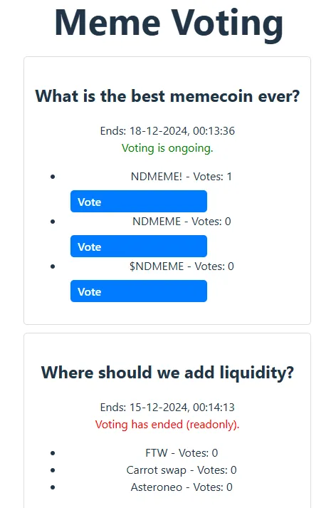

# Creating a frontend to interact with a NEO X Smart contract

Intro

in my previous tutorials we have looked at ways to create a smartcontract and to test it using hardhat. please see [https://medium.com/p/3c71019c571e](https://medium.com/p/3c71019c571e) if you have not read it yet as it will be the basis for this tutorial.

Today I want to show you how you can easily get a frontend up and running that is implementing the smart contract using a metamask tutorial as a quick start. [https://docs.metamask.io/wallet/tutorials/react-dapp-global-state/](https://docs.metamask.io/wallet/tutorials/react-dapp-global-state/)

## Prerequisites

Make sure you have some $GAS on the testnet to execute a vote.

You have 2 options to get some NeoX testnet tokens:

- You can claim It on the [NeoX faucet website](https://neoxwish.ngd.network/)

- Or you can join [NeoX Discord server](https://discord.gg/neosmarteconomy) and go to the #dev-resources channel to interact
  with the faucet bot

## Step 1: Initialize your project

First, we’ll need to create a folder for our project. Navigate to your command line and input the following.

    mkdir voting-frontend
    cd voting-frontend

Now that you are inside your project folder, you will use npm init to initialize the project.

If you don’t have npm installed yet, [follow these instructions to install Node.js and npm](https://docs.npmjs.com/downloading-and-installing-node-js-and-npm).

Now you are ready to initialize your project just type npm init and fill information. Here is what we choose for our test:

    "name": "voting-frontend",
      "version": "1.0.0",
      "description": "My Neox voting frontend",
      "main": "index.js",
      "scripts": {
        "test": "echo \"Error: no test specified\" && exit 1"
      },
      "author": "Snakeyrob",
      "license": "ISC"
    }

    Is this OK? (yes)

## Step 2: Take the metamask example code

Clone, fork or download the code provided on [https://github.com/MetaMask/vite-react-global-tutorial](https://github.com/MetaMask/vite-react-global-tutorial) into your voting-frontend folder.

Verify if everything works by running the bash cmd

    npm install
    npm run dev

The result should look like this:

    $ npm run dev

    > 6963-demo@0.0.0 dev
    > vite

    Port 5173 is in use, trying another one...

      VITE v5.2.12  ready in 155 ms

      ➜  Local:   http://localhost:5174/
      ➜  Network: use --host to expose

## Step 3: Install additional dependencies

To interact with the contract you need to use the ethers library.
So in bash run the following command.

    npm install ethers

## Step 4: Get the contract ABI

In the previous tutorial we created the voting contract and compiled it.
Once compiled you have an artifact folder containing a folder contract and that contains a folder for your contract which contains a json with your contract name. for example in my case artifacts/contracts/NdMemeVoting.sol/NdMemeVoting.json.

In this Json file you need to extract the contents of the property abi.
Copy everything from [ to ].

Now in your project create a file called VotingABI.ts.
Start by writing down

    export const abi =

And then copy paste the entire abi behind it. which should look like this :

    export const abi = [
      {
        "inputs": [],
        "stateMutability": "nonpayable",
        "type": "constructor"
      },
      {
        "anonymous": false,
        "inputs":
    .....
    ];

## Step 5: Setup the UI for voting.

To interact with the contract we will need some basic UI that retrieves the data from the smartcontract, displays it and allows the user to initiate a vote.

In our examples we are using voting topics, so I’m gonna run you throught the steps to take to show topics and to vote for it.

First we add a new file called Voting.tsx and add the imports including the created abi file.

    import React, { useEffect, useState } from "react";
    import { ethers } from "ethers";
    import { abi } from "./VotingABI"; // Replace with the actual ABI file or object

Second we define the topic interface.

    interface Topic {
      id: number;
      description: string;
      endTime: number;
      options: string[];
      votes: number[];
      finalized: boolean;
    }

Third we define a basic component that expects the contractAddress which is the address of the contract you deployed when following the tutorial and rpc url of Neo X which is [https://neoxt4seed1.ngd.network](https://neoxt4seed1.ngd.network). It would be best to have these in the environment file but for simplicity we are not doing that in this tutorial.

    const MemeVoting = ({ contractAddress, rpcUrl }: { contractAddress: string; rpcUrl: string }) => {
      const [provider, setProvider] = useState<ethers.JsonRpcProvider | null>(null);
      const [contract, setContract] = useState<ethers.Contract | null>(null);
      const [topics, setTopics] = useState<Topic[]>([]);
      const [loading, setLoading] = useState<boolean>(true);

      if (loading) {
        return 
Loading topics...
;
      }

      return (
        

          <h1>Meme Voting</h1>
        

      );
    };

    export default MemeVoting;

## Step 6: Interact with the contract to get the topics

So to get the topics from the contract we will be adding a fetchTopics method which expects an ethers.Contract as input.

The method could look like this.

    // Fetch topics from the contract
      const fetchTopics = async (contractInstance: ethers.Contract) => {
        try {
          const topicCount = await contractInstance.topicCount();
          const fetchedTopics: Topic[] = [];

          for (let i = 0; i < topicCount; i++) {
            try {
              await contractInstance.getTopicDetails(i);

              const [description, endTime, optionDescriptions, optionVoteCounts] = await contractInstance.getTopicDetails(i);

              const finalized = Date.now() / 1000 > endTime; // Determine if voting has ended
              const votes: number[] = [];
              for (let j = 0; j < optionDescriptions.length; j++) {
                const voteCount = optionVoteCounts[j];
                votes.push(Number(voteCount));
              }

              fetchedTopics.push({
                id: i,
                description,
                endTime: Number(endTime),
                options: optionDescriptions,
                votes,
                finalized,
              });
            } catch (err) {
              console.error(`Error fetching details for topic ${i}:`, err);
            }
          }

          setTopics(fetchedTopics);
          setLoading(false);
        } catch (error) {
          console.error("Error fetching topics:", error);
          setLoading(false);
        }
      };

What it does is, requesting the number of topics from the smartcontract.
Then creating a loop to retrieve all those topics by invoking getTopicDetails from our previous tutorial and setting up the list of topics.

Once we have this we can initialize the component like this so it will fetch the topics when loaded.

      // Initialize provider and contract
      useEffect(() => {
        const initialize = async () => {
          try {
            // Connect to the blockchain (read-only provider)
            const providerInstance = new ethers.JsonRpcProvider(rpcUrl);
            setProvider(providerInstance);

            // Create contract instance (read-only)
            const contractInstance = new ethers.Contract(contractAddress, abi, providerInstance);
            setContract(contractInstance);

            // Fetch topics
            await fetchTopics(contractInstance);
          } catch (error) {
            console.error("Initialization error:", error);
          }
        };
        initialize();
      }, [contractAddress, rpcUrl]);

## Step 7: Implement the vote method

In order to support voting we do a similar implementation by calling the vote method on the smartcontract.

But in order to use the vote method we first need to create an interface so the build won't break. it will looks like 
      
      interface VoteContract extends BaseContract{
        /**
        * Casts a vote on a specific topic with the selected option.
        * @param topicId - The unique identifier of the topic.
        * @param option - The selected option for voting.
        * @returns A Promise that resolves once the transaction is processed.
        */
        vote(topicId: string | number, option: string | number): Promise<TransactionResponse >;
      }

The implementation for this looks like

      // Handle voting
      const handleVote = async (topicId: number, option: string) => {
        if (!contract) {
          alert("Contract is not initialized.");
          return;
        }

        try {
          if (typeof (window as any).ethereum === "undefined") {
            alert("MetaMask is not installed. Please install MetaMask.");
            return;
          }

          // Request MetaMask connection
          const browserProvider = new ethers.BrowserProvider((window as any).ethereum);
          await browserProvider.send("eth_requestAccounts", []);
          const signer = await browserProvider.getSigner();

          // Create a signer-enabled contract
          const signerContract = contract.connect(signer);

          // Submit vote
          const tx = await (signerContract as VoteContract).vote(topicId, option);
          await tx.wait();

          alert("Vote submitted successfully!");
          await fetchTopics(contract); // Refresh topics
        } catch (error) {
          console.error("Error voting:", error);
          alert("Failed to submit vote. Check the console for details.");
        }
      };

## Step 8: Implement the UI

Now we can change the component to display the topics and add buttons to vote. This could look like

     

          <h1>Meme Voting</h1>
          {topics.length === 0 && 
No topics available for voting.
}
          {topics.map((topic) => (
            

              <h2>{topic.description}</h2>
              

                Ends: {new Date(topic.endTime * 1000).toLocaleString()}
                 
                {topic.finalized ? (
                  Voting has ended (readonly).
                ) : (
                  Voting is ongoing.
                )}
              

              <ul>
                {topic.options.map((option, index) => (
                  <li key={index}>
                    {option} - Votes: {topic.votes[index]}
                    {!topic.finalized && (
                      <button
                        onClick={() => handleVote(topic.id, option)}
                        style={{
                          marginLeft: "10px",
                          padding: "5px 10px",
                          backgroundColor: "#007bff",
                          color: "white",
                          border: "none",
                          borderRadius: "5px",
                          cursor: "pointer",
                        }}
                      >
                        Vote
                      </button>
                    )}
                  </li>
                ))}
              </ul>
            

          ))}
        

Now we modify App.tsx to use the voting component.

    import './App.css'
    import Voting from './components/Voting'

    function App() {
      const contractAddress = "0x675649b32511a3Cc0e664f27f98740a8fb5f6fE0"; // Replace with your deployed contract address

      return (
          <Voting contractAddress={contractAddress} rpcUrl='https://neoxt4seed1.ngd.network'></Voting>
      )
    }

    export default App

And voila we have ourselves a voting implementation.

Now run “npm run dev” and your website should similar to this.

## Conclusion

Congratulations you successfully manage to create your own frontend to interact with a smartcontract on theNeoX chain. To recap you learnt how to:

- Use the ABI to setup contract interactions

- Use the Ethers library to fetch data from a smartcontract.

- Use the Ethers library to invoke method on a smartcontract.

You can view the source at: https://github.com/snakeyrob/neox-voting-frontend

Now you’re fully equiped to apply the skills from this tutorial to build out your own custom dApp project! As always if you have
any questions don’t hesitate to reach out on the [NeoX Discord server](https://discord.gg/neosmarteconomy).
